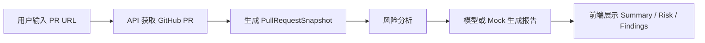

# AI PR Reviewer

**AI PR Reviewer** 是一个面向 GitHub Pull Request 的 AI 代码评审工具。它可以读取 PR 变更，生成 PR 总结、风险等级和结构化 Review findings，帮助开发者更快理解改动、定位高风险代码，并形成可执行的评审建议。

## Live Demo

[立即体验 GitHub Pages Demo](https://cc-c122.github.io/AI-PR-Reviewer/)

GitHub Pages Demo 是**静态演示模式**：

- 不需要后端
- 不需要银行卡
- 不需要 GitHub Token
- 不需要 OpenAI Key
- 使用浏览器内置 mock 数据展示完整评审流程

这个 Demo 适合快速查看产品交互、报告结构和 Review 工作流。完整的 GitHub PR 获取、数据库持久化和真实模型调用需要在本地完整模式或服务端部署模式下运行。

## 功能特性

- **PR 变更总结**：概括 PR 目的、变更规模、关键文件和基础风险。
- **风险代码识别**：根据 changed files、diff 信号和路径特征识别潜在风险。
- **Review 建议生成**：输出结构化 findings，包括证据、建议和是否阻塞合并。
- **严重级别和置信度**：支持 `critical`、`major`、`minor`、`info` 以及 confidence 标注。
- **本地持久化**：使用 Prisma + SQLite 保存分析任务、PR Snapshot 和报告。
- **GitHub Pages 静态 Demo**：无需任何密钥即可体验完整页面流程。

## 本地完整模式

本地完整模式支持真实分析公开 GitHub PR：

- 输入公开 GitHub PR URL
- 后端通过 Octokit 获取 PR 元数据和 changed files
- 生成 PR 总结、风险等级和 Review findings
- Prisma + SQLite 持久化任务和报告
- 配置 `OPENAI_API_KEY` 时使用真实 OpenAI-compatible provider
- 没有 key 时自动使用 `MockReviewModelClient`

## 技术栈

- React
- Vite
- TypeScript
- Fastify
- Prisma
- SQLite
- Octokit
- Zod
- OpenAI-compatible provider

## 架构流程



## 本地运行

```bash
pnpm install
cp .env.example .env
pnpm prisma:generate
pnpm prisma:migrate --name init
pnpm dev
```

默认地址：

- Web: `http://localhost:5173`
- API: `http://localhost:4000`
- Health Check: `http://localhost:4000/api/health`

## 验证命令

```bash
pnpm typecheck
pnpm lint
pnpm test
pnpm build
```

## 环境变量

复制 `.env.example` 为 `.env` 后按需配置：

| 变量 | 说明 |
| --- | --- |
| `GITHUB_TOKEN` | 可选。公开 PR 不配置也可使用；配置后 GitHub API rate limit 更高。 |
| `OPENAI_API_KEY` | 可选。配置后启用真实 OpenAI-compatible provider；不配置时使用 mock。 |
| `OPENAI_MODEL` | 可选。模型名，默认 `gpt-4o-mini`。 |
| `OPENAI_BASE_URL` | 可选。OpenAI-compatible API 地址，默认 `https://api.openai.com/v1`。 |
| `DATABASE_URL` | SQLite 数据库地址，默认可使用 `file:./dev.db`。 |
| `API_PORT` | API 端口，默认 `4000`。 |
| `WEB_PORT` | Vite Web 端口，默认 `5173`。 |
| `NODE_ENV` | 设置为 `production` 时，Fastify 可服务前端构建产物。 |

项目不会把 GitHub Token、OpenAI Key 或完整请求 headers 存入数据库。

## 部署

Render 单服务部署说明见 [docs/deployment.md](docs/deployment.md)。服务端部署后同一个服务会同时提供 Web 页面和 `/api/*` 接口；未配置 `OPENAI_API_KEY` 时会使用 mock 模型。
